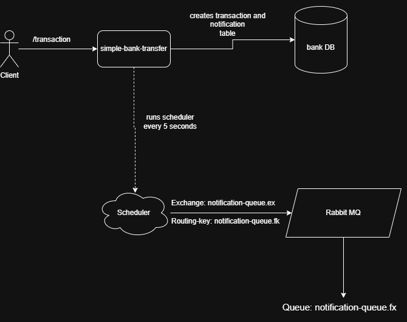

# simple-bank-transfer

### Como rodar o projeto

**Downloads:**

1. [Docker](https://www.docker.com/products/docker-desktop/)
2. [Java 21](https://adoptium.net/pt-BR/temurin/releases?version=21)
3. **Clonar projeto**
```
git clone https://github.com/AugustoKlein/simple-bank-transfer.git
 ```
4. IDEA: IntelliJ IDEA

## Decisões de design e arquitetura adotadas

Uma API simples de envio de dinheiro de uma conta para outra.

### Documentação Swagger

- Documento Swagger: [swagger.yaml](swagger.yaml)

### Banco de dados

- Banco de dados: MySQL
- Migration: Flyway

### Mensageria

- Serviço: RabbitMQ

### Explicação do ciclo

A API se baseia em 3 tabelas que serão populadas conforme a requisição do cliente, primeiramente é preciso criar
a conta pela rota `/account`, quando no mínimo duas contas forem criadas é possível fazer uma transferência de uma
conta para outra utilizando a rota `/transaction`, assim atualização a conta especificada na requisição.

Baseado no _design_ **Outbox Pattern**, quando uma transação é feita, será criada uma instância da tabela `Notification`.

Utilizando de um Scheduler/Job que irá rodar a cada 5 segundos, será avaliado quais notificações estão com o status `PENDING`
e as mesmas serão enviadas a uma exchange chamada `notification-queue.ex`.


